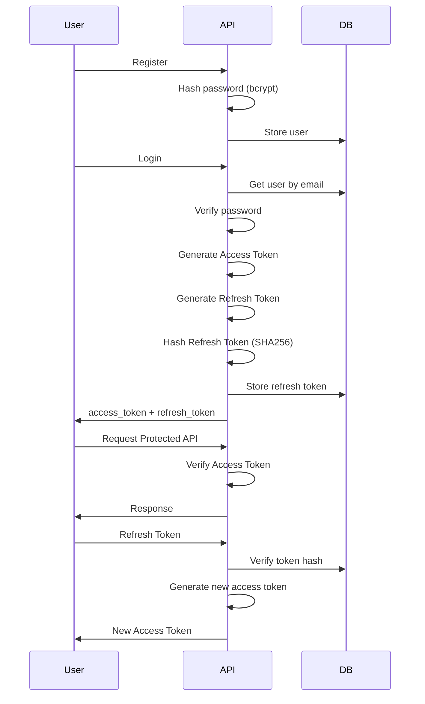
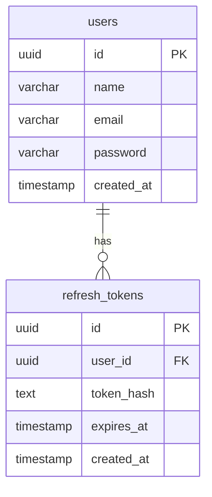

# 🚀 NestJS Authentication API


A simple **Authentication REST API** built with **NestJS** and **PostgreSQL** implementing a secure **JWT authentication system** using **Access Token** and **Refresh Token**.

This project intentionally **does not use ORM or Passport** in order to better understand the **core mechanics of authentication, token validation, and database interaction**.

Instead, the project uses:

* Native **PostgreSQL driver (`pg`)**
* Direct **JWT service**
* Manual **Auth Guard implementation**

This helps build stronger **backend fundamentals** and deeper understanding of authentication systems.

---

# ✨ Features

✅ User Registration <br>
✅ Secure Login System <br>
✅ JWT Access Token Authentication <br>
✅ Refresh Token Mechanism <br>
✅ Logout / Token Revocation <br>
✅ Password Hashing with bcrypt <br>
✅ Refresh Token Hashing (SHA256) <br>
✅ Protected Routes using Custom Auth Guard <br>
✅ Direct PostgreSQL queries using `pg` <br>

---

# 🧰 Tech Stack

### Backend Framework

* **NestJS**

### Database

* **PostgreSQL**

### Database Driver

* **pg (node-postgres)**
  Used instead of ORM to interact directly with the database.

### Authentication

* **JWT (JSON Web Token)** using `@nestjs/jwt`

### Security

* **bcrypt** → password hashing
* **SHA256** → refresh token hashing before storing in database

---

# 🏗 Architecture Overview

The project follows the **modular architecture** recommended by NestJS.

```
src
├───common
│   ├───exceptions
│   ├───guards
│   │       auth.guard.ts
│   │
│   ├───logger
│   └───utils
│           users.pg-error-map.ts
│
├───config
├───database
│       database.constants.ts
│       database.module.ts
│       database.service.spec.ts
│
└───modules
    ├───auth
    │   │   auth.constants.ts
    │   │   auth.controller.spec.ts
    │   │   auth.controller.ts
    │   │   auth.module.ts
    │   │   auth.service.spec.ts
    │   │
    │   ├───dto
    │   │       login.dto.ts
    │   │       register.dto.ts
    │   │
    │   ├───helper
    │   │       date.ts
    │   │
    │   ├───interface
    │   │       hashing-service.ts
    │   │       refresh-token.ts
    │   │
    │   ├───repository
    │   │       refresh_token.repository.ts
    │   │
    │   └───service
    │           auth.service.ts
    │           bcrypt.service.ts
    │           sha256.service.ts
    │
    └───users
        │   users.module.ts
        │
        ├───application
        │   │   users.service.spec.ts
        │   │   users.service.ts
        │   │
        │   └───dto
        │           update-user.dto.ts
        │
        ├───domain
        │   ├───entities
        │   │       user.ts
        │   │
        │   ├───repositories
        │   └───services
        ├───infrastruktur
        │   ├───queries
        │   └───repositories
        │           users.repository.ts
        │
        └───presentation
            │   users.controller.spec.ts
            │
            └───controllers
                    users.controller.ts
```

Key design decisions:

* No ORM used
* Queries written manually using `pg`
* Custom Auth Guard without Passport
* Clear separation between **controller**, **service**, and **data layer**

---

# 🔐 Authentication Flow



---

# 🗄 Database Schema



### Table Explanation

#### users

| field      | description            |
| ---------- | ---------------------- |
| id         | unique identifier      |
| name       | user name              |
| email      | user email             |
| password   | bcrypt hashed password |
| created_at | timestamp user created |

#### refresh_tokens

| field      | description                 |
| ---------- | --------------------------- |
| id         | token id                    |
| user_id    | reference to user           |
| token_hash | sha256 hashed refresh token |
| expires_at | expiration time             |
| created_at | token creation timestamp    |

---

# 🔒 Security Implementation

### Password Hashing

Passwords are never stored in plain text.

```
password → bcrypt → stored in database
```

---

### Refresh Token Hashing

Refresh tokens are hashed before storing them.

```
refresh_token → sha256 → stored in database
```

If the database is compromised, attackers **cannot directly reuse refresh tokens**.

---

### Route Protection

Protected routes use a **custom Auth Guard** that:

1. Extracts JWT from the request header
2. Verifies token using `JwtService`
3. Attaches payload to the request object

Example header:

```
Authorization: Bearer access_token
```

---

# 📡 API Endpoints

## Register

```
POST /auth/register
```

Example Request

```json
{
  "name": "John Doe",
  "email": "john@mail.com",
  "password": "password123"
}
```

---

## Login

```
POST /auth/login
```

Example Request

```json
{
  "email": "john@mail.com",
  "password": "password123"
}
```

Response

```json
{
  "access_token": "xxxx",
  "refresh_token": "xxxx"
}
```

---

## Refresh Token

Used to generate a **new access token** when the current one expires.

```
POST /auth/refresh
```

### Request Body

```json
{
  "refresh_token": "your_refresh_token"
}
```

### Process

1. Server receives refresh token
2. Token is hashed using **SHA256**
3. Server checks token hash in database
4. If valid → generate new access token
5. If invalid → request rejected

### Response

```json
{
  "access_token": "new_access_token"
}
```

---

## Logout

Used to **revoke refresh token**.

```
POST /auth/logout
```

### Request Body

```json
{
  "refresh_token": "your_refresh_token"
}
```

### Process

1. Refresh token received
2. Token hashed with **SHA256**
3. Token hash removed from database
4. User session invalidated

---

## Example Protected Route

Example of accessing a protected API endpoint.

```
GET /users/profile
```

Header:

```
Authorization: Bearer access_token
```

---

# ⚙️ Installation

Clone repository

```
git clone https://github.com/hafidh-khalifatullah/NestJs_Authentication_API
```

Move into project folder

```
cd NestJs_Authentication_API
```

Install dependencies

```
npm install
```

---

# 🔧 Environment Variables

Create `.env` file:

```
PG_HOST= your_host
PG_PORT= your_port
PG_USER= your_user
PG_PASSWORD= your_password
PG_DB= your_db

JWT_ACCESS_SECRET=your_access_secret
JWT_REFRESH_SECRET=your_refresh_secret

ACCESS_TOKEN_EXPIRES=15m
REFRESH_TOKEN_EXPIRES=7d
```

---

# ▶ Running the Application

Run development server:

```
npm run start:dev
```

Server will run at:

```
http://localhost:3000
```

---

# 🎯 Learning Objectives

This project helped me understand:

* NestJS modular architecture
* JWT authentication flow
* Access Token & Refresh Token strategy
* Password hashing best practices
* Refresh token hashing security
* Direct PostgreSQL queries using `pg`
* Implementing authentication **without relying on ORM or Passport**

---

# 🚧 Future Improvements

Planned improvements:

* Refresh Token Rotation
* Role-Based Access Control (RBAC)
* Rate Limiting
* Swagger API Documentation
* Unit Testing
* Docker Support
* CI/CD Pipeline

---

# 👨‍💻 Author

**Hafidh**

Backend Developer (Learning Journey)

If you found this project interesting, feel free to **star the repository** ⭐
